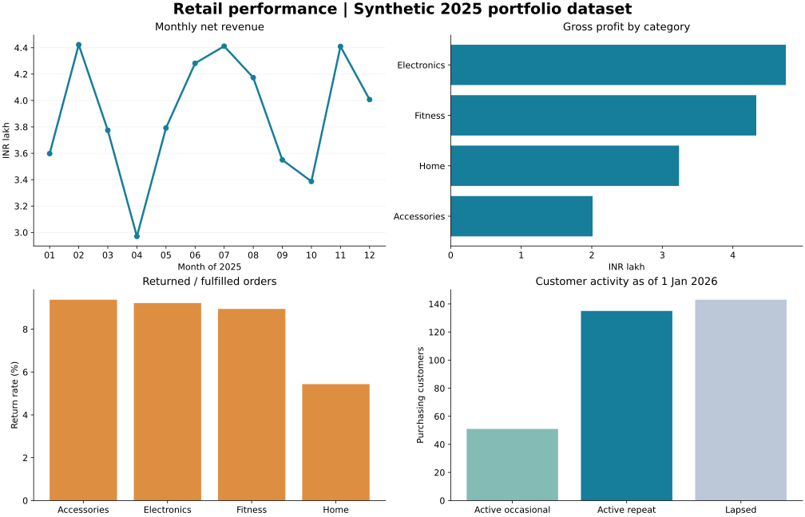

# Retail Performance Analytics

A reproducible Python and SQL case study covering order quality, revenue, product profitability, returns and customer activity.

**Data:** synthetic retail orders for calendar 2025, generated with seed 42. This is an independent portfolio demonstration, separate from the assignment files at the repository root. It contains no real customer information or claimed client results. Created with ChatGPT assistance.



## Business questions

- How do monthly net revenue and gross profit change?
- Which categories contribute the most gross profit?
- How frequently are fulfilled orders returned?
- Which purchasing customers are active or lapsed at year-end?

Read the [findings and recommendations](reports/findings.md), inspect the [SQL](sql/analysis.sql), or open the [analysis notebook](analysis.ipynb).

## Run locally

Python 3.11+ is recommended. Run these commands from this project folder:

```bash
python -m venv .venv
# macOS / Linux
source .venv/bin/activate
# Windows PowerShell alternative: .venv\Scripts\Activate.ps1
python -m pip install -r requirements.txt
python src/generate_data.py
python src/analyze.py
python -m unittest discover -s tests -v
```

The raw CSV is included, so regenerating data is optional. The analysis recreates its own `reports/retail.sqlite` database and generated reports. The notebook requires a Jupyter environment separately; it is optional and uses the same pipeline.

## Workflow

1. Preserve raw input and remove only exact duplicate rows.
2. Reject conflicting order IDs instead of silently selecting a record.
3. Standardize channel labels and label missing regions `Unknown`.
4. Quarantine records that fail required-field, date, domain or numeric checks.
5. Calculate revenue and product cost with integer paise and explicit rounding.
6. Load SQLite and execute views using aggregations, CTEs and a `LAG` window function.
7. Reconcile SQL totals with pandas and produce CSV tables, charts and an executive summary.

## Metric definitions

| Metric | Definition |
| --- | --- |
| Valid placed orders | Unique validated order IDs, including completed, returned and cancelled |
| Net revenue | Completed-order quantity × unit price × (1 − discount), rounded half-up to paise per order |
| Product cost | Completed-order quantity × unit cost |
| Gross profit | Net revenue − product cost |
| Gross margin | Total gross profit / total net revenue |
| Average order value | Net revenue / completed orders |
| Return rate | Returned / (completed + returned), excluding cancellations |
| Repeat customer share | Customers with at least two completed orders / all purchasing customers in 2025 |
| Recency | Days from last completed purchase to 1 Jan 2026 |
| Active repeat | Recency ≤ 90 days and at least three completed orders |
| Active occasional | Recency ≤ 90 days and fewer than three completed orders |
| Lapsed | Recency > 90 days |

Revenue is assigned to the original order month using final status. Returned inventory is assumed fully recoverable, with zero revenue and product cost. Return handling, shipping, tax, marketing and overhead are excluded. These metrics do not measure net profit, cash flow or causal marketing impact. Segmentation thresholds are illustrative business rules, not a predictive model.

## Files

| Path | Purpose |
| --- | --- |
| `data/orders_raw.csv` | 1,220 raw synthetic rows, including deliberate defects |
| `data/DICTIONARY.md` | Grain, units, domains and generation assumptions |
| `src/generate_data.py` | Deterministic data generator |
| `src/analyze.py` | Validation, accounting, SQLite execution, reconciliation and reports |
| `sql/analysis.sql` | Four analytical views |
| `analysis.ipynb` | Guided notebook using the same analysis |
| `reports/findings.md` | Computed business summary and limitations |
| `reports/metrics.json` | Machine-readable quality counts and KPIs |
| `reports/*.csv` | Monthly, category, channel, customer and quarantine exports |
| `tests/test_analysis.py` | Tests for duplicates, conflicting IDs, invalid values, returns and rounding |

## Data generation assumptions

Dates are sampled across 2025 without a seasonal model. Product price and cost ratios differ by category by design. Channels and regions are randomly assigned; statuses use the same probability weights for every category. Therefore, observed differences are a demonstration of analytical methods and cannot establish real commercial effects.

## Skills demonstrated

Python, pandas, SQLite, SQL window functions, data validation, reproducible analysis, financial metric definitions, customer segmentation, Matplotlib and business communication.
